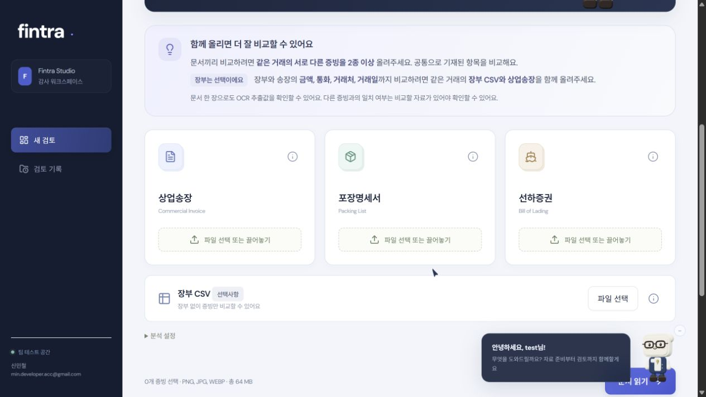
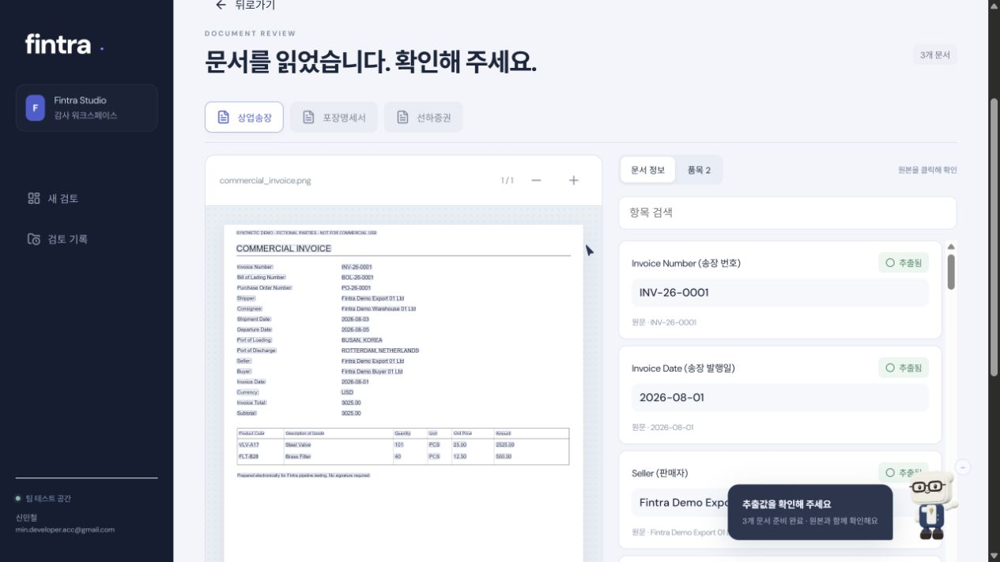
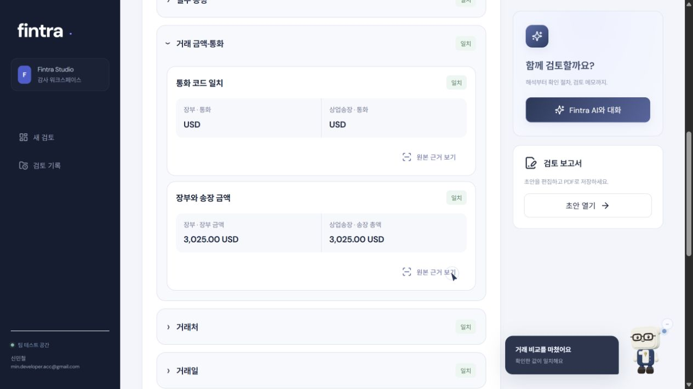
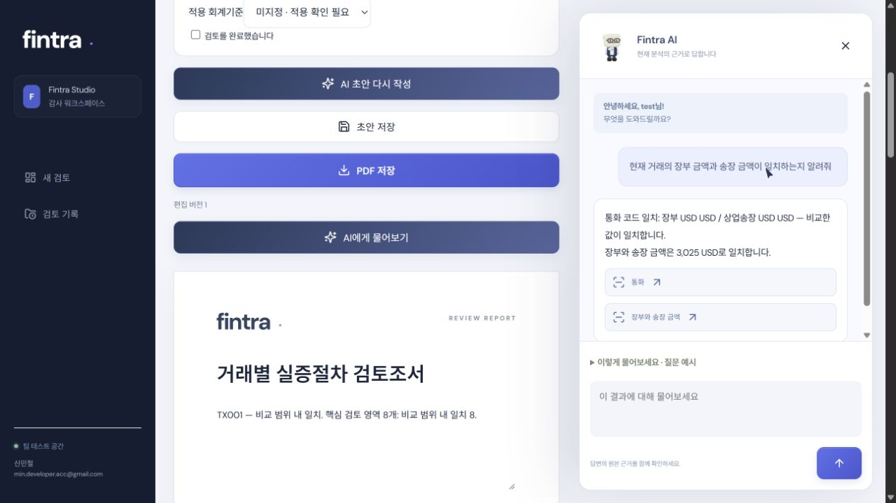
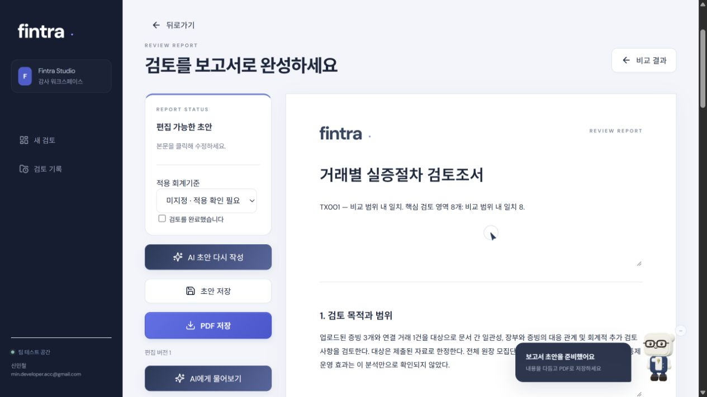
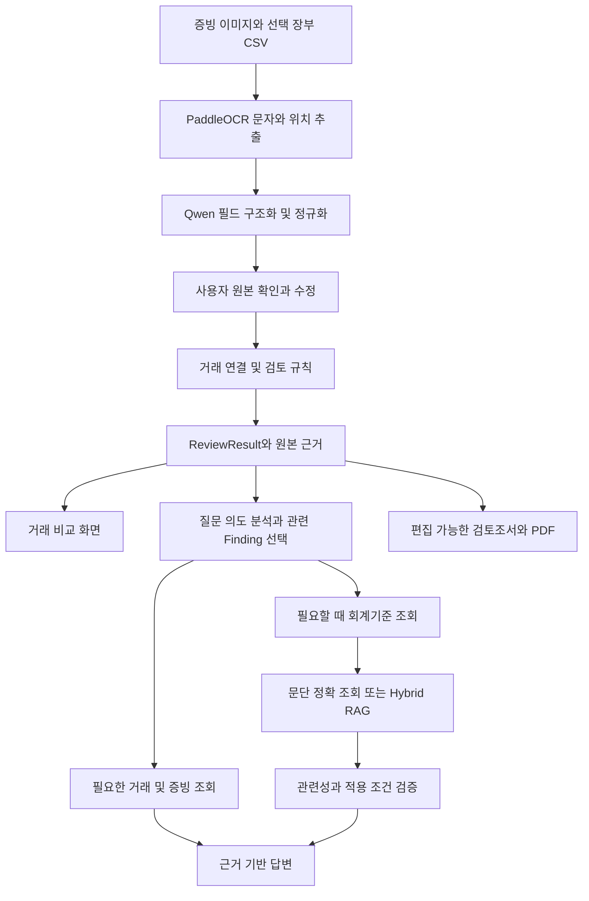

<p align="center">
  
</p>

# Fintra

**물류 증빙과 회계장부를 대사하고, 원본 근거를 따라 검토조서를 작성하는 AI 감사 보조 서비스**

[서비스 체험](https://hayden-shin-dev.github.io/Fintra-OCR/) | [실행 방법](docs/SETUP.md) | [검증 기록](docs/RELEASE_REVIEW.md) | [기술과 출처](SOURCES.md)

[](https://github.com/Hayden-Shin-Dev/Fintra-OCR/actions/workflows/portfolio-checks.yml)

상업송장, 포장명세서, 선하증권에 흩어진 거래 정보를 읽고 장부와 맞춰 봅니다. 차이가 발견되면 해당 값의 원본을 확인하고, AI에게 추가 확인 절차를 질문한 뒤 검토조서까지 이어서 작성할 수 있습니다.

**신민철 | 서비스 설계, OCR 파이프라인, 검토 규칙, AI 대화, 웹 UI 및 배포 구현**

Python / FastAPI / PaddleOCR / Qwen / Ollama / Hybrid RAG / SQLite / JavaScript / Three.js

## 해결하려는 문제

거래 하나를 확인하려고 여러 문서를 번갈아 열고 금액, 수량, 날짜와 참조번호를 대조해야 합니다. 차이를 찾은 뒤에도 원본을 다시 찾고, 추가로 확인할 자료와 검토 내용을 정리하는 일이 남습니다.

Fintra는 **문서를 읽는 과정과 사람이 판단하는 과정을 연결**하려고 만들었습니다. 추출된 값은 원본과 함께 확인하고, 비교 결과는 규칙으로 판정하며, AI는 그 결과를 설명하고 검토 초안을 작성하도록 역할을 나눴습니다.

## 실제 서비스 화면

아래는 실행 중인 Fintra에서 합성 거래 자료로 직접 캡처한 화면입니다. 실제 고객 자료는 사용하지 않았습니다. 상단 표지 이미지는 서비스 소개용 이미지이며, 아래 캡처와 구분합니다.

### 1. 같은 거래의 자료를 한곳에 연결



문서 종류별 업로드와 설명을 제공하고, 비교에 필요한 자료를 안내합니다. 문서끼리 비교하려면 같은 거래의 증빙 2종 이상이 필요합니다. 장부는 선택사항이며 장부 금액, 통화, 거래처, 거래일까지 대사하려면 장부 CSV와 상업송장을 함께 올립니다.

### 2. AI가 읽은 값을 원본과 함께 확인



왼쪽 원본과 오른쪽 구조화된 필드를 나란히 확인합니다. 문서 번호, 발행일과 거래처를 원문과 대조하고, 비교 시작 전 잘못 추출된 값을 수정할 수 있습니다. 캡처는 비교가 끝난 거래의 추출값을 다시 확인하는 화면입니다.

### 3. 판정 옆에서 실제 비교값을 확인



일치 여부만 보여주지 않고 **어떤 문서의 어떤 값을 비교했는지** 함께 표시합니다. 반복되는 문서 간 검사는 검토 영역으로 묶고, 각 항목의 원본 근거로 이동할 수 있게 했습니다. 이 예제에서는 장부와 송장 금액이 모두 3,025 USD입니다.

### 4. 거래 근거를 대화로 조회



보고서를 보면서 현재 거래에 대해 질문할 수 있습니다. 사실 조회, 리스크 설명, 추가 증빙 요청과 검토 메모 작성은 서로 다른 요청으로 처리합니다. 화면의 대화는 실제 서비스 응답이며, 설명을 위해 답변을 합성하거나 덧씌우지 않았습니다.

### 5. 검토 결과를 편집 가능한 조서로 정리



비교 결과와 검토 범위, 수행한 절차, 추가 확인 사항을 초안으로 정리합니다. 담당자가 내용을 수정하고 검토한 뒤 PDF로 저장합니다. 본문 편집으로 원래 검사 판정이 바뀌지 않도록 분리했습니다.

## 시스템 구조



OCR 패키지와 웹 워크스페이스는 이 저장소에 포함되어 있습니다. 전체 서비스는 별도 설치된 OCR, 거래 비교 및 회계기준 검색 런타임과 연동합니다. 모델 가중치와 회계기준 코퍼스는 포함하지 않습니다.

## 구현에서 중요하게 본 부분

| 문제 | 설계한 방식 | 코드 |
| --- | --- | --- |
| 그럴듯한 추출값이 검토 결론으로 이어지는 문제 | 추출 근거를 보존하고 사용자 확인 이후 규칙으로 비교 | [근거 기반 추출](fintraocr/grounded.py), [검토 규칙](studio/backend/review_rules.py) |
| 문서에 없는 보조 필드를 모두 누락으로 세는 문제 | 필수 누락과 검토 대상 아님을 구분하고 영역별로 집계 | [비교 범위](studio/backend/comparison_scope.py) |
| 질문에 답하지 않고 검사 결과만 반복하는 문제 | 질문 의도와 관련 Finding을 분리해 답변 구성 | [대화 분석](studio/backend/conversational_analysis.py), [Finding 문맥](studio/backend/finding_context.py) |
| 단어가 비슷한 기준서를 거래 근거로 연결하는 문제 | 검색 이후 거래 사실과 적용 조건에 맞는지 검증 | [관련성 검증](studio/backend/source_relevance.py) |
| 번호가 명확한 문단까지 유사도 검색하는 문제 | 기준서 번호와 문단은 정확 조회, 의미 질문은 벡터와 키워드 검색 후 재정렬 | [문단 저장소](studio/backend/kasb_kb.py), [Hybrid 검색](studio/backend/kasb_search.py) |
| 여러 사용자의 문서와 대화가 섞이는 문제 | SQLite 계정, scrypt 비밀번호 해시, 자료별 소유자 접근 제어 | [계정](studio/backend/accounts.py), [웹 서버](studio/backend/server.py) |

일치 판정은 제공된 자료와 비교 범위 안에서 값이 일치한다는 의미입니다. 거래의 적정성을 확정하는 감사의견과 구분하며, AI가 제시한 원인이나 절차도 담당자의 확인이 필요합니다.

## 기술 구성

| 영역 | 기술과 역할 |
| --- | --- |
| 문서 인식 | Python, PaddleOCR, OpenCV, Pydantic으로 문자 위치, 필드와 품목 구조를 처리 |
| 로컬 모델 | Ollama와 Qwen 사용. 질문 분류, 추론, 검증 모델을 설정으로 분리 가능 |
| 기준 검색 | 문단 메타데이터, 벡터 검색, BM25 계열 키워드 검색, 재정렬과 관련성 검증 |
| 웹 | HTML, CSS, JavaScript. Three.js로 서비스 캐릭터 렌더링 |
| API와 저장 | OCR API는 FastAPI, Studio는 Python HTTP 서버. 계정은 SQLite, 검토 데이터는 로컬 저장 |
| 보고서 | ReportLab 기반 PDF 출력 |
| 배포와 검사 | Windows 실행 관리, Cloudflare Tunnel, GitHub Pages 접속 안내, GitHub Actions |

## 검증과 직접 실행

2026-10-01 기준 OCR 테스트 **304개 통과**를 확인했습니다. 합성 예제 실행, 패키지 빌드와 GitHub Actions 검사도 통과했습니다. 이 수치는 테스트 통과 건수이며 OCR 인식 정확도나 챗봇의 정답률을 뜻하지 않습니다. 상세 범위는 [검증 기록](docs/RELEASE_REVIEW.md)에 남겼습니다.

**모델 설치 없이 처리 구조를 확인하려면:**

```bash
git clone https://github.com/Hayden-Shin-Dev/Fintra-OCR.git
cd Fintra-OCR
python -m venv .venv
```

가상환경을 활성화한 뒤 실행합니다. Windows는 `.venv\Scripts\activate`, macOS와 Linux는 `source .venv/bin/activate`를 사용합니다.

```bash
python -m pip install -e ".[test]"
python -m fintraocr map examples/synthetic.ocr.json --proposal examples/synthetic.proposal.json --output outputs/demo.json
python -m pytest -q
```

위 예제는 합성 OCR 결과를 구조화하는 과정입니다. 실제 이미지 OCR과 전체 Studio 실행에 필요한 설정은 [설치 및 실행](docs/SETUP.md)에 구분했습니다. Studio 통합 테스트 일부는 별도 런타임과 로컬 fixture가 필요합니다.

**서비스를 체험하려면:** [Fintra 접속](https://hayden-shin-dev.github.io/Fintra-OCR/) 후 회원가입하고 샘플 A, B, C를 선택합니다. 각각 정상 일치, 금액 불일치, 수량 누락 사례입니다. 운영 PC가 켜져 있을 때 접속할 수 있으며, 실제 업무 문서 대신 예시 자료 사용을 권장합니다.

<details>
<summary>저장소 구성</summary>

| 경로 | 내용 |
| --- | --- |
| `fintraocr/` | OCR, 문서 필드 추출과 검증 |
| `studio/backend/` | 거래 검토, 계정, 챗봇, 기준 조회와 보고서 |
| `studio/web/` | 업로드부터 보고서까지 이어지는 화면 |
| `studio/tools/` | 실행, 평가, 지식베이스 동기화 도구 |
| `examples/` | 합성 예제 |
| `tests/`, `studio/tests/` | 추출, 비교, 대화, 권한과 관련성 검증 테스트 |
| `docs/` | 실행 안내, 공개 점검 기록과 서비스 캡처 |

</details>

## 저작권과 출처

Copyright (c) 2026 신민철. 자체 코드와 문서는 포트폴리오 검토 목적으로 공개합니다. 일반적인 수정, 재배포, 상업적 이용 권한은 부여하지 않으며 GitHub 약관에 따른 열람과 포크 및 법령상 권리는 유지합니다.

외부 라이브러리와 모델에는 각 권리자의 조건이 적용됩니다. KASB 및 IFRS 원문의 실제 서비스 이용은 별도 권리 확인이 필요하며, 원문과 검색 인덱스는 이 저장소에서 배포하지 않습니다.

[LICENSE](LICENSE) | [외부 라이선스](THIRD_PARTY_NOTICES.md) | [출처](SOURCES.md) | [보안 제보](SECURITY.md)

신민철 | [min.developer.acc@gmail.com](mailto:min.developer.acc@gmail.com)
